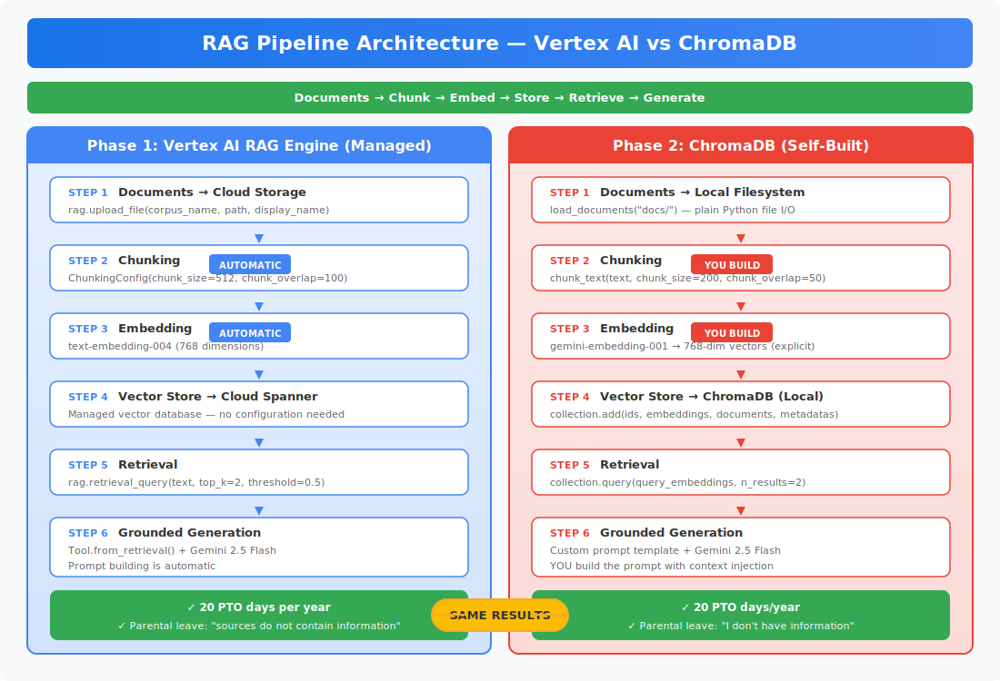

# RAG Pipeline: Vertex AI vs ChromaDB

A hands-on comparison of Retrieval-Augmented Generation (RAG) using Google's managed Vertex AI RAG Engine and a self-built pipeline with ChromaDB. Same pattern, different infrastructure.

## Architecture



| Step | Phase 1 — Vertex AI (Managed) | Phase 2 — ChromaDB (Self-Built) |
|------|-------------------------------|----------------------------------|
| **1. Load** | Upload to GCS bucket | Read from local filesystem |
| **2. Chunk** | Automatic via `ChunkingConfig` | Custom `chunk_text()` function |
| **3. Embed** | `text-embedding-004` (automatic on upload) | `gemini-embedding-001` (explicit API call) |
| **4. Store** | Cloud Spanner (`RagManagedDb`) | ChromaDB (local, in-memory) |
| **5. Retrieve** | `rag.retrieval_query()` | `collection.query()` |
| **6. Generate** | `Tool.from_retrieval()` + Gemini 2.5 Flash | Custom prompt template + Gemini 2.5 Flash |

## Results Comparison

| Question | Phase 1 (Vertex AI) | Phase 2 (ChromaDB) |
|----------|--------------------|--------------------|
| PTO for 4-year employee? | 20 PTO days per year | 20 PTO days/year |
| International meal limit? | $100 per day | $100/day |
| Password requirements? | All 5 criteria listed | All 5 criteria listed |
| Parental leave? (unanswerable) | "sources do not contain information" | "I don't have information about that" |

## Key Findings

1. The RAG pattern is portable across any vector database or managed service.
2. Vertex AI abstracts infrastructure. ChromaDB gives full control.
3. Neither pipeline hallucinated on unanswerable questions.
4. New documents are immediately searchable without rebuilding.

## Project Structure

```
rag-pipeline/
├── README.md
├── ARCHITECTURE.md
├── QA_GUIDE.md
├── architecture_diagram.svg
├── docs/
│   ├── pto_policy.txt
│   ├── expense_policy.txt
│   └── security_policy.txt
├── phase1/
│   ├── README.md
│   └── rag_lean.py
└── phase2/
    ├── README.md
    ├── step1_chunking.py
    ├── step2_embedding.py
    ├── step3_vector_store.py
    ├── step4_retrieval.py
    └── step5_generation.py
```

## Quick Start

### Phase 1: Vertex AI RAG Engine
```bash
cd phase1
pip install google-cloud-aiplatform
gcloud config set project YOUR_PROJECT_ID
python rag_lean.py
```

### Phase 2: ChromaDB
```bash
cd phase2
pip install chromadb google-genai
export GOOGLE_API_KEY="your-api-key"
python step5_generation.py
```

## Build Issues Solved

| Issue | Error | Fix |
|-------|-------|-----|
| Region blocked | RAG Engine in us-central1 restricted | Use `europe-west1` |
| GCS cross-region | 500 on `import_files` | Use `upload_file()` direct |
| API parameter naming | Unexpected keyword `rag_corpora` | Use `rag_resources` with `RagResource` |
| Model not allowed | Policy violated for `gemini-2.0-flash` | Use `gemini-2.5-flash` |
| Embedding not found | `text-embedding-004` not found v1beta | Use `gemini-embedding-001` |
| Deprecated SDK | `google.generativeai` deprecated | Use `google.genai` |

## Portfolio Context

Project 8 in a series demonstrating progressive AI/ML patterns on GCP. First project handling unstructured data via RAG.

## License

MIT
